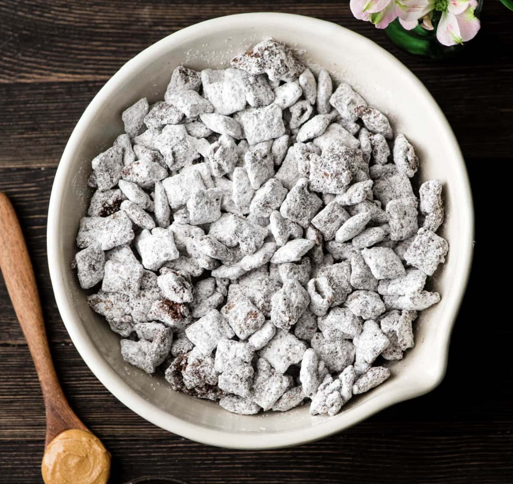

# Make Puppy Chow With Me!

Have you ever had puppy chow before? And no, I'm not talking about actual dog food! Puppy chow is a delicious sweet snack that is sure to satisfy your cravings and get your hands a little dirty! This treat has always been irresistible to me and my sister throughout our whole lives. Don't be afraid to try this simple and tasty delight that is sure to tempt you to eat the whole bowl!

### INGREDIENTS
- 1 Cup Chocolate Chips
- 1 Cup Peanut Butter
- 6-7 Cups Rice Chex Cereal
- 1-2 Cups Powered Sugar

## HOW TO MAKE
1. Melt peanut butter and chocolate together, either on the stovetop or in the microwave

2. Add 3 cups of cereal to a large bowl. Pour halfp of your chocolate/peanut butter mixture over the cereal.

3. Add 3 more cups of cereal to the bowl and then pour the rest of the chocolate/peanut butter mixture on top.

4. Stir until the cereal is evenly coated. If there are pools of chocolate/peanut butter at the bottom of your bowl, add more cereal 1/4 cup at a time until all the cereal is coated.

5. Add your powered sugar in and mix until all of the chocolate/peanut butter cereal is covered.

6. Enjoy!!