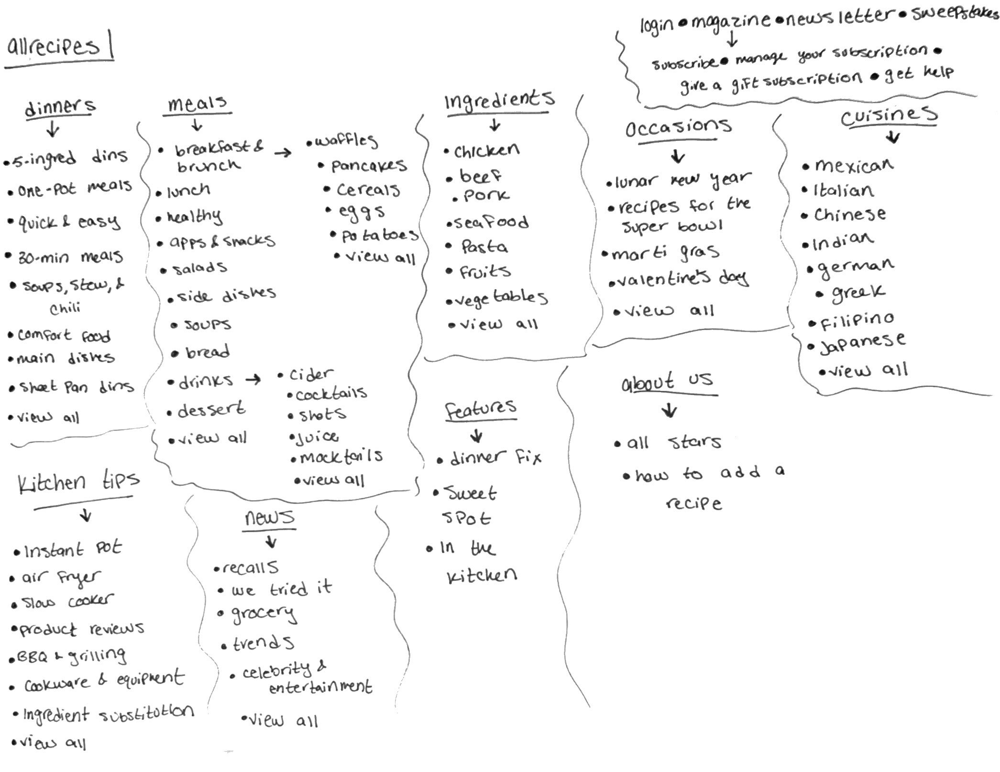
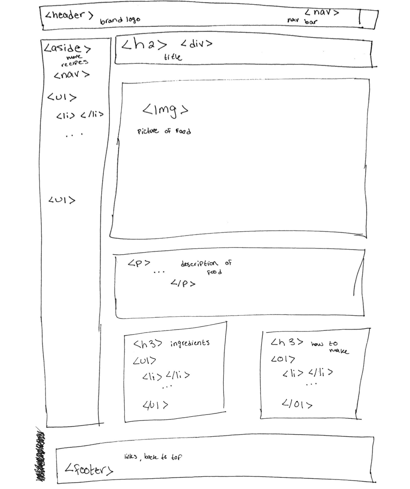

# Week 02 HW

## Sitemap
I used the allrecipes website
https://www.allrecipes.com/

## Wireframe
Wireframe for my recipe website

## Reading Reaction

After reading the short article I can see how important it is to make wireframes and constantly be getting advide and new points of view. Getting as much knowledge as you can about the situation in which you are developing a website for is ideal in making the lest mistake as possible (although mistakes are inevitable). Constantly checking in with clients or designers is also a great tool in keeping up-to-date in what is expected so there isnt unnecessary processes or work done that does not help address the main problems.