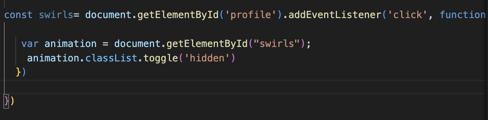
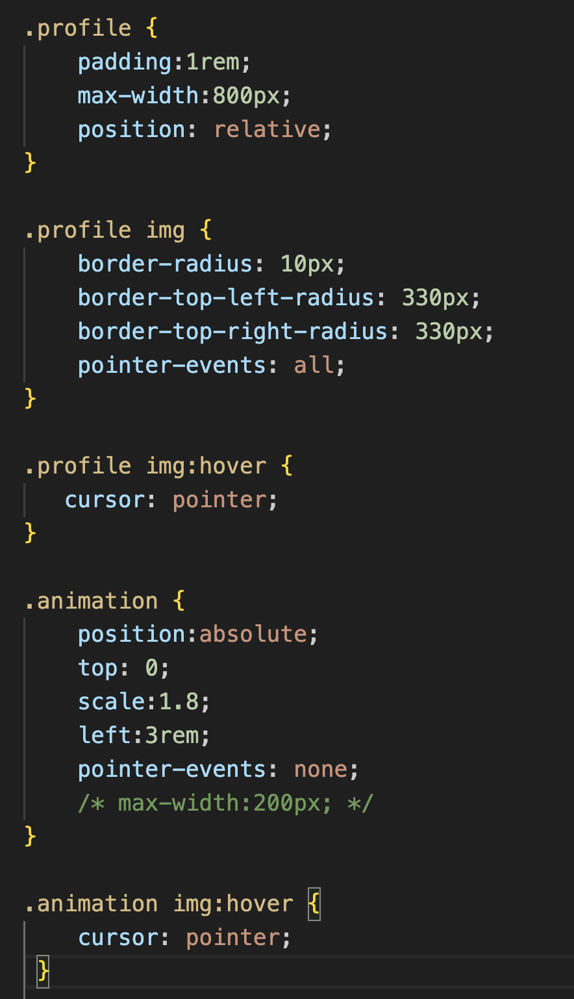

# My Portfolio- Final Website
1. Demo site and show each page(layouts and unique elements)

    - Home page
    - About page
    - Portfolio page
        - Each project's individual page
    - Contact page
   

2. Show snippet of code

- toggle between showing and hidden using js
    - pointer events!!
- using absolute and relative positioning 

3. Next Steps: if I had more time

    - play with collapsible/hidden nav bar
    - change the way contact page displays information
        - possibly use javascript to show/hide on click
    - totally change layout on media queries (keep theme but change some elements)
    - be able to click project images and make them get bigger (in pop out module?)